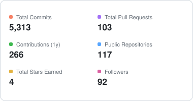
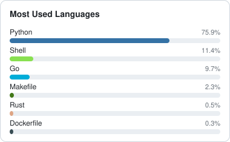
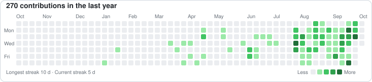

# Zhiquan Yu · Heisenberg

**Cloud Native Engineer / 容器 PaaS · Go · Kubernetes**

📍 Beijing, China · 🌐 [Blog](https://yuzhiquan.github.io) · 📖 [知乎](https://www.zhihu.com/people/hanniba) · 💼 [LinkedIn](https://www.linkedin.com/in/zhiquan-yu-7a701b97/) · 🐦 [@ZhiquanYu](https://twitter.com/ZhiquanYu)

---

## 👨‍💻 About me

- 🔭 当前在做 **容器 PaaS 平台 / Service Mesh 全集群落地 / 多云基础设施**
- 🌱 持续投入：**Kubernetes 调度与弹性、Service Mesh 与多集群、容器网络、GPU 算力调度与隔离、云原生可观测性**
- 👯 社区参与：`@kubernetes` / `@kubernetes-sigs` member，`sig-instrumentation`、`wg-structured-logging` reviewer
- 💬 乐于交流：Go、K8s 控制器与 Operator、调度器扩展、Structured Logging、Metrics/Tracing
- 📫 找工作：云原生工程师 / 架构师方向，**Open to new opportunity**

## 🛠 Tech stack

**Languages**

  
  
  

**Cloud Native & Platform**

  
  
  
  
  
  
  
  

**Infra · Cloud · Networking**

  
  
  
  
  
  

**AI Infra**

  
  
  
  

## 📊 GitHub stats

  
  

  

## 🔀 Recent pull requests

<!--START_SECTION:prs-->
- [#1439](https://github.com/kubernetes-sigs/agent-sandbox/pull/1439) refactor(warmpool): read mirrored PodScheduled instead of fetching the P... · `kubernetes-sigs/agent-sandbox` · _merged_
- [#140308](https://github.com/kubernetes/kubernetes/pull/140308) scheduler: fix empty-string topology domain in TAS conflict check · `kubernetes/kubernetes` · _open_
- [#1605](https://github.com/kubernetes-sigs/agent-sandbox/pull/1605) feat(clients/ts): support automatic sandbox expiration · `kubernetes-sigs/agent-sandbox` · _merged_
- [#140143](https://github.com/kubernetes/kubernetes/pull/140143) scheduler: add podgroup_cache_missed_events_total metric · `kubernetes/kubernetes` · _closed_
- [#1339](https://github.com/kubernetes-sigs/agent-sandbox/pull/1339) feat(mcp): add /healthz and /readyz probe endpoints · `kubernetes-sigs/agent-sandbox` · _merged_
- [#1329](https://github.com/kubernetes-sigs/agent-sandbox/pull/1329) feat(mcp): add list_files and file_exists tools · `kubernetes-sigs/agent-sandbox` · _merged_
- [#1291](https://github.com/kubernetes-sigs/agent-sandbox/pull/1291) feat(api): mirror backing pod's PodScheduled condition into Sandbox stat... · `kubernetes-sigs/agent-sandbox` · _merged_
- [#1290](https://github.com/kubernetes-sigs/agent-sandbox/pull/1290) feat(warmpool): configurable readiness grace period and unschedulable re... · `kubernetes-sigs/agent-sandbox` · _merged_
- [#6529](https://github.com/kubernetes/org/pull/6529) Add yuzhiquan to kubernetes-sigs org · `kubernetes/org` · _merged_
- [#139923](https://github.com/kubernetes/kubernetes/pull/139923) Degrade gracefully when etcd Maintenance.Status is PermissionDenied · `kubernetes/kubernetes` · _open_
<!--END_SECTION:prs-->

## 🧠 AI Infra

📦 [ai-infra-book-analysis](https://github.com/yuzhiquan/ai-infra-book-analysis/tree/main/beginner-series) · [beginner-series](https://github.com/yuzhiquan/ai-infra-book-analysis/tree/main/beginner-series) + [blogs](https://github.com/yuzhiquan/ai-infra-book-analysis/tree/main/blogs) 🔒

<!--START_SECTION:aiinfra-->
- [在 Kubernetes 上跑通大模型训练与推理（面向初学者）](https://github.com/yuzhiquan/ai-infra-book-analysis/blob/main/beginner-series/README.md) · 2026-09-16 · `入门系列`
- [第 0 篇：这个系列讲什么，不讲什么](https://github.com/yuzhiquan/ai-infra-book-analysis/blob/main/beginner-series/00-scope-and-boundaries.zh-CN.md) · 2026-09-16 · `入门系列`
- [第 1 篇：一次推理请求在 Kubernetes 上经过什么](https://github.com/yuzhiquan/ai-infra-book-analysis/blob/main/beginner-series/01-request-path.zh-CN.md) · 2026-09-16 · `入门系列`
- [第 2 篇：容量账 —— 先估一个数，再去集群里找它](https://github.com/yuzhiquan/ai-infra-book-analysis/blob/main/beginner-series/02-capacity-accounting.zh-CN.md) · 2026-09-16 · `入门系列`
- [第 3 篇：数据 —— 为什么 tokenize 完还要定长](https://github.com/yuzhiquan/ai-infra-book-analysis/blob/main/beginner-series/03-data-processing.zh-CN.md) · 2026-09-16 · `入门系列`
- [第 4 篇：训练 —— N 张卡怎么变成一个训练组](https://github.com/yuzhiquan/ai-infra-book-analysis/blob/main/beginner-series/04-training.zh-CN.md) · 2026-09-16 · `入门系列`

<b>📂 展开其余 12 篇</b>（共 18 篇）

- [第 5 篇：批量推理 —— 同一个引擎，相反的目标](https://github.com/yuzhiquan/ai-infra-book-analysis/blob/main/beginner-series/05-batch-inference.zh-CN.md) · 2026-09-16 · `入门系列`
- [第 6 篇：在线服务 —— 让流量只打到真正就绪的实例](https://github.com/yuzhiquan/ai-infra-book-analysis/blob/main/beginner-series/06-online-serving.zh-CN.md) · 2026-09-16 · `入门系列`
- [AI Infra 与云原生技术博客 / AI Infrastructure and Cloud Native Systems](https://github.com/yuzhiquan/ai-infra-book-analysis/blob/main/blogs/README.md) · 2026-09-14 · `博客`
- [从 HTTP 请求到 token：K8s 工程师需要理解的推理服务生命周期](https://github.com/yuzhiquan/ai-infra-book-analysis/blob/main/blogs/01-from-http-to-tokens.zh-CN.md) · 2026-09-14 · `博客`
- [Pod 已经 Running，模型为什么还没 Ready？](https://github.com/yuzhiquan/ai-infra-book-analysis/blob/main/blogs/02-model-startup.zh-CN.md) · 2026-09-14 · `博客`
- [为什么同样的 QPS，会压垮你的模型服务？](https://github.com/yuzhiquan/ai-infra-book-analysis/blob/main/blogs/03-workload-and-capacity.zh-CN.md) · 2026-09-14 · `博客`
- [大模型服务的 HPA 应该看什么？](https://github.com/yuzhiquan/ai-infra-book-analysis/blob/main/blogs/04-inference-autoscaling.zh-CN.md) · 2026-09-14 · `博客`
- [滚动发布时，正在生成的回答怎么办？](https://github.com/yuzhiquan/ai-infra-book-analysis/blob/main/blogs/05-streaming-rollouts.zh-CN.md) · 2026-09-14 · `博客`
- [负载均衡遇上 KV Cache：请求应该发给谁？](https://github.com/yuzhiquan/ai-infra-book-analysis/blob/main/blogs/06-kv-aware-routing.zh-CN.md) · 2026-09-14 · `博客`
- [从 K8s Job 到分布式训练：worker、状态与恢复](https://github.com/yuzhiquan/ai-infra-book-analysis/blob/main/blogs/07-training-on-kubernetes.zh-CN.md) · 2026-09-14 · `博客`
- [从数据到在线生成：用 Kubernetes、Ray、PyTorch 与 vLLM 跑通大模型链路](https://github.com/yuzhiquan/ai-infra-book-analysis/blob/main/blogs/08-end-to-end-llm-pipeline.zh-CN.md) · 2026-09-14 · `博客`
- [Kubernetes + Ray + PyTorch + vLLM pipeline](https://github.com/yuzhiquan/ai-infra-book-analysis/blob/main/blogs/examples/08-llm-pipeline/README.md) · 2026-09-14 · `博客`

<!--END_SECTION:aiinfra-->

## 🤖 AI Agent

📦 🔒 [MiniAgent-tutorial](https://github.com/yuzhiquan/MiniAgent-tutorial) · [agent-from-scratch](https://github.com/yuzhiquan/agent-from-scratch)

<!--START_SECTION:aiagent-->
- [第七章：当 Agent 遇上知识库——RAG 是什么，怎么用 Mini-Agent 的思路来理解它](https://github.com/yuzhiquan/MiniAgent-tutorial/blob/main/07_rag.md) · 2026-05-11 · `MiniAgent 源码`
- [Mini-Agent 源码解析系列文章](https://github.com/yuzhiquan/MiniAgent-tutorial/blob/main/README.md) · 2026-04-21 · `MiniAgent 源码`
- [第零章：什么是 AI Agent？从零认识 Mini-Agent](https://github.com/yuzhiquan/MiniAgent-tutorial/blob/main/00_overview.md) · 2026-04-21 · `MiniAgent 源码`
- [第一章：心脏地带——Agent 执行循环](https://github.com/yuzhiquan/MiniAgent-tutorial/blob/main/01_agent_loop.md) · 2026-04-21 · `MiniAgent 源码`
- [第二章：Agent 的双手——工具系统设计](https://github.com/yuzhiquan/MiniAgent-tutorial/blob/main/02_tools_system.md) · 2026-04-21 · `MiniAgent 源码`
- [第三章：Agent 的大脑接口——LLM 客户端与多 Provider 支持](https://github.com/yuzhiquan/MiniAgent-tutorial/blob/main/03_llm_client.md) · 2026-04-21 · `MiniAgent 源码`

<b>📂 展开其余 10 篇</b>（共 16 篇）

- [第四章：记忆与遗忘——上下文管理与自动摘要](https://github.com/yuzhiquan/MiniAgent-tutorial/blob/main/04_context_management.md) · 2026-04-21 · `MiniAgent 源码`
- [第五章：更多技能——Skills 系统与 MCP 集成](https://github.com/yuzhiquan/MiniAgent-tutorial/blob/main/05_skills_mcp.md) · 2026-04-21 · `MiniAgent 源码`
- [第六章：门面担当——CLI 设计与配置管理](https://github.com/yuzhiquan/MiniAgent-tutorial/blob/main/06_cli_config.md) · 2026-04-21 · `MiniAgent 源码`
- [Agent 开发系列教程](https://github.com/yuzhiquan/agent-from-scratch/blob/main/README.md) · 2026-04-20 · `从零实现`
- [第一篇：AI Agent 是什么？为什么选择 LangGraph？](https://github.com/yuzhiquan/agent-from-scratch/blob/main/01_introduction.md) · 2026-04-20 · `从零实现`
- [第二篇：LangGraph 核心概念——从零理解 Agent 框架](https://github.com/yuzhiquan/agent-from-scratch/blob/main/02_langgraph_101.md) · 2026-04-20 · `从零实现`
- [第三篇：构建邮件分类与回复 Agent](https://github.com/yuzhiquan/agent-from-scratch/blob/main/03_email_assistant.md) · 2026-04-20 · `从零实现`
- [第四篇：人机协作（Human-in-the-Loop）——让 Agent 更安全可控](https://github.com/yuzhiquan/agent-from-scratch/blob/main/04_hitl.md) · 2026-04-20 · `从零实现`
- [第五篇：记忆与自适应学习——让 Agent 越用越好](https://github.com/yuzhiquan/agent-from-scratch/blob/main/05_memory.md) · 2026-04-20 · `从零实现`
- [第六篇：测试与评估——如何知道 Agent 表现好不好？](https://github.com/yuzhiquan/agent-from-scratch/blob/main/06_evaluation.md) · 2026-04-20 · `从零实现`

<!--END_SECTION:aiagent-->

## 🎯 面试准备

📦 [tech-review-notes](https://github.com/yuzhiquan/tech-review-notes)（GPU 调度 / 算力隔离） · 🔒 [havesomefun](https://github.com/yuzhiquan/havesomefun)（算法模板与 Go 手册）

<!--START_SECTION:interview-->
- [面试速成 · 最小题单（绕开 21 个模块，直接打 20 道题）](https://github.com/yuzhiquan/havesomefun/blob/master/%E9%9D%A2%E8%AF%95%E9%80%9F%E6%88%90-%E6%9C%80%E5%B0%8F%E9%A2%98%E5%8D%95.md) · 2026-09-29 · `算法手册`
- [忘了怎么办 · 20 分钟遗忘诊断 + 重拾练法](https://github.com/yuzhiquan/havesomefun/blob/master/%E9%81%97%E5%BF%98%E8%AF%8A%E6%96%AD%E4%B8%8E%E9%87%8D%E6%8B%BE%E6%96%B9%E6%B3%95.md) · 2026-09-29 · `算法手册`
- [面经高频题库 · 多维分析与你的刷题优先级](https://github.com/yuzhiquan/havesomefun/blob/master/%E9%9D%A2%E7%BB%8F%E9%AB%98%E9%A2%91%E9%A2%98-%E5%A4%9A%E7%BB%B4%E5%88%86%E6%9E%90%E4%B8%8E%E4%BC%98%E5%85%88%E7%BA%A7.md) · 2026-09-28 · `算法手册`
- [《代码随想录》× 我的 Go 解题模板手册 · 对照总表](https://github.com/yuzhiquan/havesomefun/blob/master/%E4%BB%A3%E7%A0%81%E9%9A%8F%E6%83%B3%E5%BD%95-%E5%AF%B9%E7%85%A7%E4%B8%8E%E8%A1%A5%E5%85%85%E6%80%BB%E8%A1%A8.md) · 2026-09-28 · `算法手册`
- [《labuladong 算法小抄》× 我的 Go 解题模板手册 · 对照总表](https://github.com/yuzhiquan/havesomefun/blob/master/labuladong-%E5%AF%B9%E7%85%A7%E4%B8%8E%E8%A1%A5%E5%85%85%E6%80%BB%E8%A1%A8.md) · 2026-09-28 · `算法手册`
- [解题模板手册 · Go 版](https://github.com/yuzhiquan/havesomefun/blob/master/%E8%A7%A3%E9%A2%98%E6%A8%A1%E6%9D%BF%E6%89%8B%E5%86%8C.md) · 2026-09-28 · `算法手册`

<b>📂 展开其余 28 篇</b>（共 34 篇）

- [二叉树 · 递归框架](https://github.com/yuzhiquan/havesomefun/blob/master/%E8%A7%A3%E9%A2%98%E6%A8%A1%E6%9D%BF/%E4%BA%8C%E5%8F%89%E6%A0%91-%E9%80%92%E5%BD%92%E6%A1%86%E6%9E%B6.md) · 2026-09-28 · `算法手册`
- [动态规划 · 五步法与四类状态](https://github.com/yuzhiquan/havesomefun/blob/master/%E8%A7%A3%E9%A2%98%E6%A8%A1%E6%9D%BF/%E5%8A%A8%E6%80%81%E8%A7%84%E5%88%92-%E4%BA%94%E6%AD%A5%E6%B3%95%E4%B8%8E%E5%9B%9B%E7%B1%BB%E7%8A%B6%E6%80%81.md) · 2026-09-28 · `算法手册`
- [回溯 · 三母模板与剪枝](https://github.com/yuzhiquan/havesomefun/blob/master/%E8%A7%A3%E9%A2%98%E6%A8%A1%E6%9D%BF/%E5%9B%9E%E6%BA%AF-%E4%B8%89%E6%AF%8D%E6%A8%A1%E6%9D%BF%E4%B8%8E%E5%89%AA%E6%9E%9D.md) · 2026-09-28 · `算法手册`
- [图 · DFS 洪水填充 / 并查集 / 拓扑排序](https://github.com/yuzhiquan/havesomefun/blob/master/%E8%A7%A3%E9%A2%98%E6%A8%A1%E6%9D%BF/%E5%9B%BE-DFS%E4%B8%8E%E5%B9%B6%E6%9F%A5%E9%9B%86%E4%B8%8E%E6%8B%93%E6%89%91.md) · 2026-09-28 · `算法手册`
- [滑动窗口 · 模板与易错点](https://github.com/yuzhiquan/havesomefun/blob/master/%E8%A7%A3%E9%A2%98%E6%A8%A1%E6%9D%BF/%E6%BB%91%E5%8A%A8%E7%AA%97%E5%8F%A3-%E6%A8%A1%E6%9D%BF%E4%B8%8E%E6%98%93%E9%94%99%E7%82%B9.md) · 2026-09-28 · `算法手册`
- [二分查找 · 边界统一模板](https://github.com/yuzhiquan/havesomefun/blob/master/%E8%A7%A3%E9%A2%98%E6%A8%A1%E6%9D%BF/%E4%BA%8C%E5%88%86%E6%9F%A5%E6%89%BE-%E8%BE%B9%E7%95%8C%E7%BB%9F%E4%B8%80%E6%A8%A1%E6%9D%BF.md) · 2026-09-28 · `算法手册`
- [双指针 · 对撞、原地去重与 N 数之和](https://github.com/yuzhiquan/havesomefun/blob/master/%E8%A7%A3%E9%A2%98%E6%A8%A1%E6%9D%BF/%E5%8F%8C%E6%8C%87%E9%92%88-%E5%AF%B9%E6%92%9E%E4%B8%8E%E5%8E%9F%E5%9C%B0%E5%8E%BB%E9%87%8D.md) · 2026-09-28 · `算法手册`
- [哈希与前缀和 · 「看一眼就该想到」的查表技巧](https://github.com/yuzhiquan/havesomefun/blob/master/%E8%A7%A3%E9%A2%98%E6%A8%A1%E6%9D%BF/%E5%93%88%E5%B8%8C%E4%B8%8E%E5%89%8D%E7%BC%80%E5%92%8C.md) · 2026-09-28 · `算法手册`
- [单调栈 / 单调队列](https://github.com/yuzhiquan/havesomefun/blob/master/%E8%A7%A3%E9%A2%98%E6%A8%A1%E6%9D%BF/%E5%8D%95%E8%B0%83%E6%A0%88%E4%B8%8E%E5%8D%95%E8%B0%83%E9%98%9F%E5%88%97.md) · 2026-09-28 · `算法手册`
- [链表 · 四板斧与虚拟头](https://github.com/yuzhiquan/havesomefun/blob/master/%E8%A7%A3%E9%A2%98%E6%A8%A1%E6%9D%BF/%E9%93%BE%E8%A1%A8-%E5%9B%9B%E6%9D%BF%E6%96%A7%E4%B8%8E%E8%99%9A%E6%8B%9F%E5%A4%B4.md) · 2026-09-28 · `算法手册`
- [堆 / TopK · 「 Less 到底被谁调用」](https://github.com/yuzhiquan/havesomefun/blob/master/%E8%A7%A3%E9%A2%98%E6%A8%A1%E6%9D%BF/%E5%A0%86%E4%B8%8ETopK-%E5%B0%8F%E9%A1%B6%E5%A0%86%E4%B8%8E%E5%9B%9E%E8%B0%83.md) · 2026-09-28 · `算法手册`
- [字符串 · KMP 与原地双指针](https://github.com/yuzhiquan/havesomefun/blob/master/%E8%A7%A3%E9%A2%98%E6%A8%A1%E6%9D%BF/%E5%AD%97%E7%AC%A6%E4%B8%B2-KMP%E4%B8%8E%E5%8E%9F%E5%9C%B0%E5%8F%8C%E6%8C%87%E9%92%88.md) · 2026-09-28 · `算法手册`
- [手撕排序 · 不在 LeetCode 题号体系里，但总榜第 3](https://github.com/yuzhiquan/havesomefun/blob/master/%E8%A7%A3%E9%A2%98%E6%A8%A1%E6%9D%BF/%E6%89%8B%E6%92%95%E6%8E%92%E5%BA%8F-%E5%BF%AB%E6%8E%92%E6%8C%96%E5%9D%91%E4%B8%8E%E8%BF%BD%E9%97%AE.md) · 2026-09-28 · `算法手册`
- [区间问题 · 排序是唯一的前置条件](https://github.com/yuzhiquan/havesomefun/blob/master/%E8%A7%A3%E9%A2%98%E6%A8%A1%E6%9D%BF/%E5%8C%BA%E9%97%B4%E9%97%AE%E9%A2%98-%E5%90%88%E5%B9%B6%E4%B8%8E%E9%87%8D%E5%8F%A0%E5%88%A4%E5%AE%9A.md) · 2026-09-28 · `算法手册`
- [贪心 · 无套路，但这四类可以模板化](https://github.com/yuzhiquan/havesomefun/blob/master/%E8%A7%A3%E9%A2%98%E6%A8%A1%E6%9D%BF/%E8%B4%AA%E5%BF%83-%E5%9B%9B%E7%B1%BB%E5%8F%AF%E6%A8%A1%E6%9D%BF%E5%8C%96.md) · 2026-09-28 · `算法手册`
- [位运算与数学小题 · 「一行代码解决的那些题」](https://github.com/yuzhiquan/havesomefun/blob/master/%E8%A7%A3%E9%A2%98%E6%A8%A1%E6%9D%BF/%E4%BD%8D%E8%BF%90%E7%AE%97%E4%B8%8E%E6%95%B0%E5%AD%A6%E5%B0%8F%E9%A2%98.md) · 2026-09-28 · `算法手册`
- [栈与队列 · 六个经典骨架](https://github.com/yuzhiquan/havesomefun/blob/master/%E8%A7%A3%E9%A2%98%E6%A8%A1%E6%9D%BF/%E6%A0%88%E4%B8%8E%E9%98%9F%E5%88%97-%E5%85%AD%E4%B8%AA%E7%BB%8F%E5%85%B8.md) · 2026-09-28 · `算法手册`
- [数据结构设计 · 「把几种数据结构拼起来」](https://github.com/yuzhiquan/havesomefun/blob/master/%E8%A7%A3%E9%A2%98%E6%A8%A1%E6%9D%BF/%E6%95%B0%E6%8D%AE%E7%BB%93%E6%9E%84%E8%AE%BE%E8%AE%A1-LRU%E4%B8%8ELFU%E4%B8%8ETwitter.md) · 2026-09-28 · `算法手册`
- [BFS 框架 · 「为什么第一次到达就是最短」](https://github.com/yuzhiquan/havesomefun/blob/master/%E8%A7%A3%E9%A2%98%E6%A8%A1%E6%9D%BF/BFS%E6%A1%86%E6%9E%B6-%E6%9C%80%E7%9F%AD%E6%AD%A5%E6%95%B0%E4%B8%8E%E5%8F%8C%E5%90%91BFS.md) · 2026-09-28 · `算法手册`
- [Go 并发 · 从单例到线程安全 LRU](https://github.com/yuzhiquan/havesomefun/blob/master/%E8%A7%A3%E9%A2%98%E6%A8%A1%E6%9D%BF/Go%E5%B9%B6%E5%8F%91-%E4%BB%8E%E5%8D%95%E4%BE%8B%E5%88%B0%E7%BA%BF%E7%A8%8B%E5%AE%89%E5%85%A8LRU.md) · 2026-09-28 · `算法手册`
- [二叉搜索树 · 「中序有序」这一个性质撑起所有题](https://github.com/yuzhiquan/havesomefun/blob/master/%E8%A7%A3%E9%A2%98%E6%A8%A1%E6%9D%BF/%E4%BA%8C%E5%8F%89%E6%90%9C%E7%B4%A2%E6%A0%91-%E5%A2%9E%E5%88%A0%E6%9F%A5%E4%B8%8E%E5%90%88%E6%B3%95%E6%80%A7.md) · 2026-09-28 · `算法手册`
- [GPU 虚拟化 / 切分 / 多租户隔离 · 14 题整理与扩展](https://github.com/yuzhiquan/tech-review-notes/blob/main/GPU%E8%99%9A%E6%8B%9F%E5%8C%96%E4%B8%8E%E7%AE%97%E5%8A%9B%E9%9A%94%E7%A6%BB%E9%9D%A2%E8%AF%95%E9%A2%98%E5%BA%93-14%E9%A2%98%E6%95%B4%E7%90%86%E4%B8%8E%E6%89%A9%E5%B1%95.md) · 2026-09-26 · `GPU 调度`
- [GPU 调度岗位面试：27 题库覆盖度评估 + 补强题库](https://github.com/yuzhiquan/tech-review-notes/blob/main/GPU%E8%B0%83%E5%BA%A6%E9%9D%A2%E8%AF%95-%E8%A6%86%E7%9B%96%E5%BA%A6%E8%AF%84%E4%BC%B0%E4%B8%8E%E8%A1%A5%E5%BC%BA%E9%A2%98%E5%BA%93.md) · 2026-09-23 · `GPU 调度`
- [GPU 调度面试 · TOP10 逐字口述稿](https://github.com/yuzhiquan/tech-review-notes/blob/main/GPU%E8%B0%83%E5%BA%A6%E9%9D%A2%E8%AF%95-TOP10%E9%80%90%E5%AD%97%E5%8F%A3%E8%BF%B0%E7%A8%BF.md) · 2026-09-23 · `GPU 调度`
- [LeetCode 215 · 数组中的第 K 个最大元素](https://github.com/yuzhiquan/havesomefun/blob/master/topk/215%E7%AC%ACK%E5%A4%A7-%E8%A7%A3%E6%B3%95%E4%B8%8E%E8%BF%BD%E9%97%AE.md) · 2026-09-23 · `算法手册`
- [GPU 调度研发工程师/专家 · 27 题全解析](https://github.com/yuzhiquan/tech-review-notes/blob/main/GPU%E8%B0%83%E5%BA%A6%E9%9D%A2%E8%AF%95%E9%A2%98%E5%BA%93-27%E9%A2%98%E5%85%A8%E8%A7%A3%E6%9E%90.md) · 2026-09-22 · `GPU 调度`
- [面试语法速查：Go 与 Python](https://github.com/yuzhiquan/havesomefun/blob/master/%E9%9D%A2%E8%AF%95%E8%AF%AD%E6%B3%95%E9%80%9F%E6%9F%A5-Go%E4%B8%8EPython.md) · 2026-09-21 · `算法手册`
- [技术复习笔记 / Tech Review Notes](https://github.com/yuzhiquan/tech-review-notes/blob/main/README.md) · 2026-09-01 · `GPU 调度`

<!--END_SECTION:interview-->

Last updated: <!--START_SECTION:updated-->2026-09-29 12:06 UTC<!--END_SECTION:updated-->

---

本页动态区块由 GitHub Actions 每 30 分钟自动更新 · 源码见 <a href=".github/workflows/update-readme.yml">workflow</a>

